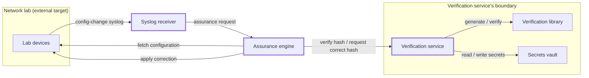
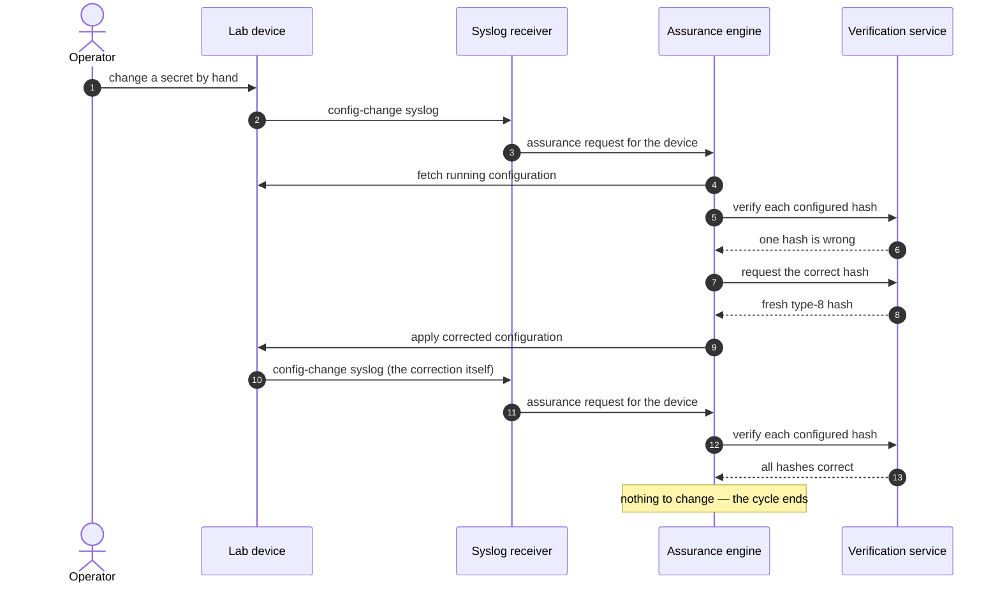

# Designing before building

An engineer updates the local credentials on every device in the network. By hand. The
change is applied correctly to **most** devices, but the engineer introduced a typo to one.
From that moment, the organization's record of its own credentials is wrong. The password
manager says one thing and the device holds another, and nothing anywhere will notice the
difference. Not monitoring, which is watching interfaces. Not the configuration
backup, which faithfully stores the new value as though it were intended. Not the
operations staff, whose logins are authenticated against a TACACS service. The gap opens
silently and stays open — through the next audit, through the handover when that engineer
leaves, until the night something goes wrong and the device cannot reach the TACACS server.
The lockout remains invisible until the network is down, logins require local credentials, and it's too late
to fix it without going onsite.

This series builds a system that closes that gap automatically: it keeps a record of what
each device's secrets are supposed to be, notices when a device changes, checks the
configured secrets against the record, and puts the right value back when they disagree.
The eight articles that follow this one each include a working archive you can download and run against real router
software on your laptop.

The interesting part is not the automation. It is that the system is deliberately
built as several small services rather than one program — a microservice architecture
applied to network automation — and this article is the design.

It is also the article that tells you where that design was wrong. Not as an afterthought
at the end: three things in this document turned out to be mistakes, and all but one of them
was corrected by measuring something rather than by thinking harder. You will meet each
correction in the article that found it.

## What are we doing here?

This series of articles builds Quelaag, a system for identifying credential drift on
network devices, and automatically correcting that drift. After reading the series you
will understand:

- Benefits and drawbacks of a microservice architecture
- The importance of well-defined boundaries
- The value of measuring while building
- Synchronous vs. asynchronous APIs

## What are we **not** doing here?

Crucially, we are not building a production-ready system. To make the code accessible to
network engineers, not just developers, we minimize defensive code. This prevents the
business logic from being obscured by exception handling, logging, input validation, and
the like. We don't avoid it entirely, but keep it to a minimum. Lastly, the system lacks
many features that would be required in production: support for external secret stores,
multiple hardware platforms, and triggering on password changes, among others.

## The system in a nutshell

Quelaag is six components. Three are deployable services; the other three are not, and
which is which turns out to be the first real design decision.



The six components, with one responsibility each:

- **The network lab** stands in for production — emulated devices running real router
  software, carrying secrets as type-8 hashes. It is not part of the system; it is the
  thing the system manages.
- **The secrets vault** holds the known-good secrets, encrypted at rest, keyed by service
  and username.
- **The verification library** generates a hash from a secret, and answers whether a
  secret and a hash match.
- **The verification service** exists to answer one question over the network: *is this hash the
  right one for this account?* It can also issue a correct replacement hash.
- **The assurance engine** brings a device back in line: reach it, read its configuration,
  have each secret verified, correct what fails.
- **The syslog receiver** turns device configuration events into work. It listens, works out which
  device changed, and tells the engine.

## One cycle, end to end

A design is only as good as its ability to describe the workflow it implements. Here is
the whole system doing its job once, from the mistyped password change to quiescence:



Events ten through thirteen are what makes this a system rather than a
script. The correction is *itself* a configuration change, so the device reports it, and
the whole cycle runs a second time. That second pass finds everything correct, changes
nothing, and therefore provokes nothing. The system comes to rest.

That is not a happy accident, it is a requirement: a design that corrects drift by making
changes, in a system triggered by changes, must be able to recognise a corrected device and
stop — or it chases its own tail for as long as you leave it running.
Everything about how the engine coalesces requests, and why it explicitly reports "nothing
to do", is derived from this property.

## Decomposition before code

Six components, three services. The three that are not services are interesting,
because deciding *not* to make something a service is a decision in itself.

The verification library is a library. It has no state, no I/O, and no lifecycle of its
own — give it the same inputs and it returns the same answer forever. Making it a service
adds complexity in the form of network I/O — which introduces risk — with no upside. It stays a
library for the whole series.

The secrets vault is a store, not a service, and it is owned. Exactly one component may
open it.

The network lab is not part of the system at all. It is the external world — and one of
the first things this series does is give the external world a stand-in, because you
cannot develop a system that rewrites router configurations against routers someone is
relying on.

What is worth noticing is that all of this was argued on paper, before a line of code
existed, where changes are trivial. The cost of moving a boundary rises
steeply once something is built on it — as this series demonstrates.

## Data ownership as the first boundary

If you take one line from this design, take this one: **exactly one component may hold a
plaintext secret.**

The verification service owns the vault. Nothing else reads it — not by agreement, but
because nothing else has any way to. What crosses that boundary is a verdict, or a freshly
generated hash. The plaintext does not.

That provides a layer of safety. The assurance engine has enable-level access to
every router you own; it logs in, and it rewrites configuration. It is also the component
most likely to be running somewhere exposed, doing risky things, at three in the morning.
Outside this boundary it can be compromised entirely without leaking a single secret,
because it never had one. When it needs to correct a password it asks for a *hash* of the
right value and pushes that.

The alternative — let the engine read the vault, since it is the thing that needs
the correct value — works perfectly and is what you would build without drawing this line
first. It is also the design where one bug in the riskiest component exposes every
credential in the estate.

This is the boundary every later article inherits.
It is also the reason the verification library eventually becomes a service: not
because of changes in how hashing works, but because something across a process boundary needed to ask a
question whose answer must never travel in plaintext.

## Where this design was wrong

Three things. Two of those were corrected by measuring something, not by thinking harder.

**Express.** This design named Express as the basis for the verification service —
sensible, minimal, what most people reach for. When the service came to be written, the
requirement turned out to be one route pair and one JSON body parse, which Node's built-in
HTTP server handles in a few lines. Express would have bought familiarity rather than
capability, and eliminated a benefit this series maintains through several articles: that a
reader installs nothing but the runtime.

**nornir.** The design chose nornir for the assurance engine's inventory, so that swapping
in an external source of truth later would be a one-component change. This added more complexity than it was worth.
At implementation, the decision was made to use a dedicated inventory file and call napalm directly,
so the declared dependency served no code at all — while napalm, the
library the engine's entire safety property rests on, went undeclared and arrived only as
nornir's transitive dependency.

**The moment of detection.** The most critical error.
This design names a moment at which a device should report that something changed. That
moment is wrong — not subtly, but wrong in a way that undermines
the system's entire premise. We will take a closer look at this later in the series.

You may ask why an article introducing a design opens by undermining it. There are two
reasons. A design document that admits its own errors before a reader can find them is
more credible than one that does not, and you are about to spend nine articles deciding
whether to trust this one. And the corrections are not
embarrassments to be tidied up, they provide valuable insight about the process.

Here is what the design got right, claimed with the same specificity: the six components
and the boundaries drawn between them survived intact. Data ownership never moved. And the
cycle above still describes the running system today — every box, every arrow, and the
settling behaviour at the end — only a single label changes.

## The log and the glossary

Two documents did more work than their size suggests, and both are in the download.

The **decision log** is append-only. Entries are never edited or deleted; when a decision
is reversed, a new entry supersedes the old one *by name*, and both stay. That rule is
what makes the Express and nornir reversals visible above rather than invisible — a design
document that quietly rewrites itself to match what got built teaches nothing, because the
reasoning that was wrong is likely to be repeated.

The **glossary** holds exactly one term per concept, used verbatim in code and documents.
It sounds like paperwork. It is what stops a system growing three names for the
same thing across two languages and six components — in a project where "verify" and
"assure" refer to genuinely different operations.

## How to read this series

The nine articles follow the build, each one a runnable milestone.
While there is no code yet, you can download the project roadmap along with the decision log and glossary as they stand at this point:

```sh
curl -LO https://github.com/joshgilby/quelaag/releases/download/milestone-0/quelaag-milestone-0.tar.gz
```

Subsequent articles will include links to their respective archives.

The reader this is written for is a network engineer getting into programming: the
networking is assumed and the software is explained. `vrf clab-mgmt` needs no explanation; `uv
run` does.

Some articles in the series will run without any hardware or licensed image at all. The rest needs
a two-device lab on your laptop, which [the next article](01-you-dont-need-a-rack-of-routers.md)
builds — along with the first script, and an exact demonstration of how not to reboot a
virtual router.

One last thing to keep in mind. Nearly every claim in this series was checked against a real
device, and several failed the check — including three that produced
no error at all, just a confident wrong answer. That is the thread running through all
nine articles, and it starts in the next one.

---

*The roadmap as this article describes it, before any code existed:
[quelaag-milestone-0.tar.gz](https://happypathnetworking.com/assets/releases/quelaag-milestone-0.tar.gz)
